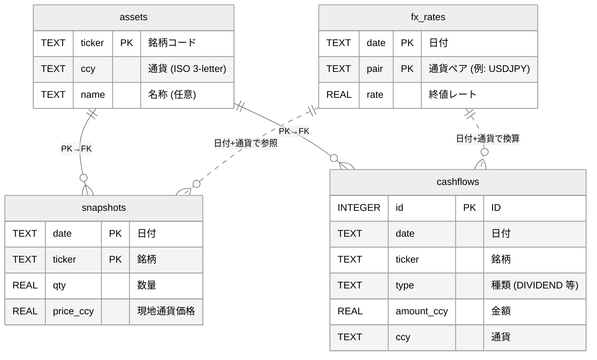

# Money Diary

Money Diary は、個人利用に特化した資産・収支トラッキングツールです。日次スナップショットを手入力し、為替データと突き合わせることで資産変動の要因を「価格」「為替」「クロス」「フロー」に分解して把握できます。AI Agent と組み合わせれば、入力支援や分析・可視化を半自動化できます。

## 特徴
- 日次スナップショット入力（数量・現地通貨価格のみ）
- 同日付の為替レートを参照して自動で円換算
- 原因分解ビューで価格 / 為替 / クロス / フローを可視化
- シンプルな DB スキーマ（`assets` / `fx_rates` / `snapshots` / `cashflows`）
- CSV / SQL 入出力で自動化しやすい構造
- Agent 連携を想定したシナリオ（コピー入力、分析、可視化など）

## クイックスタート
1. **DB の初期化**
   ```bash
   sqlite3 money_diary.db < schema.sql
   ```
2. **銘柄登録**
   ```sql
   INSERT INTO assets (ticker, ccy) VALUES ('VTI','USD');
   INSERT INTO assets (ticker, ccy) VALUES ('eMAXIS_SP500','JPY');
   ```
3. **為替レート入力**
   - 手動で登録する場合
     ```sql
     INSERT INTO fx_rates (date, pair, rate) VALUES ('2025-09-15','USDJPY',145.2);
     ```
   - スクリプトで自動取得する場合
     ```bash
     # 単日
     ./scripts/fetch_fx.py 2025-09-15 2025-09-15 USD JPY --db money_diary.db

     # 期間指定（例: 直近1年間）
     ./scripts/fetch_fx.py 2023-09-18 2024-09-18 USD JPY --db money_diary.db
     ```
4. **株価の自動取得（任意）**
   ```bash
   # 2024年のVTIとS&P500指数（^GSPC）
   ./scripts/fetch_prices.py 2024-01-01 2024-12-31 VTI SNP=^GSPC --db money_diary.db

   # 当日分のみ
   ./scripts/fetch_prices.py 2025-09-18 VTI SNP=^GSPC --db money_diary.db
   ```
5. **日次スナップショット入力**
   ```sql
   INSERT INTO snapshots (date, ticker, qty, price_ccy)
     VALUES ('2025-09-15','VTI',2037.88,270.5);
   ```
6. **キャッシュフロー入力（例: 配当）**
   ```sql
   INSERT INTO cashflows (date, ticker, type, amount_ccy, ccy)
     VALUES ('2025-09-15','VTI','DIVIDEND',200,'USD');
   ```
7. **評価額ビュー（円換算）を確認**
   ```sql
   SELECT *
     FROM v_valuation
    WHERE date = '2025-09-15';
   ```
8. **原因分解ビュー（価格 / 為替 / クロス / フロー）を確認**
   ```sql
   SELECT date,
          ticker,
          round(delta_total, 3) AS total,
          round(delta_price, 3) AS price,
          round(delta_fx, 3)    AS fx,
          round(delta_cross, 3) AS cross,
          round(flow, 3)        AS flow
     FROM v_attribution
    WHERE date = '2025-09-15'
    ORDER BY ticker;  -- 'PORTFOLIO' 行も併記
   ```
9. **テスト（開発者向け）**
   ```bash
   ./scripts/test.sh
   ```

## 便利ビュー

- ポートフォリオ合計（円換算）
  ```sql
  SELECT *
    FROM v_portfolio_total
   ORDER BY date DESC
   LIMIT 5;
  ```
- 通貨別エクスポージャ
  ```sql
  SELECT *
    FROM v_currency_exposure
   WHERE date = 'YYYY-MM-DD'
   ORDER BY ccy;
  ```
- 銘柄別ウェイト付き評価額
  ```sql
  SELECT date, ticker, value_jpy, portfolio_value_jpy, round(weight, 4) AS weight
   FROM v_valuation_enriched
   WHERE date = 'YYYY-MM-DD'
   ORDER BY value_jpy DESC;
  ```

## ER 図

主要テーブルの関係は以下のとおりです（`docs/er.mermaid` と同期）。



### 手動入力スクリプト
- `scripts/add_asset.sh` : 銘柄の追加 / 更新
- `scripts/add_fx_manual.sh` : 指定日の FX レートを手入力
- `scripts/add_snapshot.sh` : スナップショットを手入力

`v_attribution` は「直近の前回スナップショット」と比較するため、月末のみの入力でも差分が計算されます。非 JPY 資産は該当日の為替レート行が必要です。

## 将来の拡張アイデア
- 可視化ダッシュボード（Streamlit / Next.js）
- Price / FX / Flow / Dividend の分解チャート
- モンテカルロによる資産シミュレーション
- Agent 連携（自動入力、グラフ生成、集計依頼など）

## 注意事項
- 完全に個人利用を想定。クラウド共有や公開環境での運用は推奨しません。
- 為替・株価データは外部 API や CSV で各自取得してください。
- 個人情報や資産データはローカル保存を推奨します。
- `money_diary.db` や `data/` ディレクトリは `.gitignore` 済みです。

## 開発者向けメモ
### Makefile
```bash
make help
make venv && make install
make db-init
make lint
make test
make quality
make gui
```
CI（GitHub Actions）では push / PR ごとに `make quality` が実行されます。

### GUI 入力（Streamlit）
1. 初回セットアップ（uv を利用）
   ```bash
   # uv が未インストールの場合: https://docs.astral.sh/uv/getting-started/ を参照
   uv python install 3.12
   uv venv --python 3.12
   uv pip install -r requirements.txt
   # もしくは make install（uv 実行をラップ）
   make install
   ```
2. 起動（`.venv` を自動利用）
   ```bash
   make gui
   # 直接起動したい場合: uv run streamlit run app/streamlit_app.py
   ```
3. 主な機能
   - Assets / FX / Snapshots のフォーム入力（UPSERT）
   - Snapshots で「評価額 (JPY)」入力から数量を自動算出（価格・為替が揃っている場合）
   - Views タブで `v_valuation` / `v_attribution` に加え、ポートフォリオ合計・通貨別エクスポージャ・ウェイト付き評価額を表示（CSVダウンロード可）
   - Views タブでポートフォリオ合計と通貨別エクスポージャの履歴を（日付範囲スライダーで）折れ線グラフ表示
   - Charts タブで `asset_prices` / `fx_rates` の任意期間をラインチャート表示
   - DB が存在しない場合は起動時に `schema.sql` を自動適用

### OpenAI API による要約（任意）
1. 環境変数 `OPENAI_API_KEY` を設定（例: `.env` に追記して起動前に読み込む）
2. `pip install -r requirements.txt` で `openai` パッケージを導入
3. Views タブの「AI要約 (OpenAI)」を開き、
   - 「選択日の要因を要約」: 現在表示中の日付の価格/為替/フローを要約
   - 「全履歴を要約」: これまでの履歴から主要変動要因を俯瞰

※ API 利用料が発生します。キーが未設定の場合は従来通りUIのみが表示されます。

---

より詳しい貢献ルールは `AGENTS.md` を参照してください。
